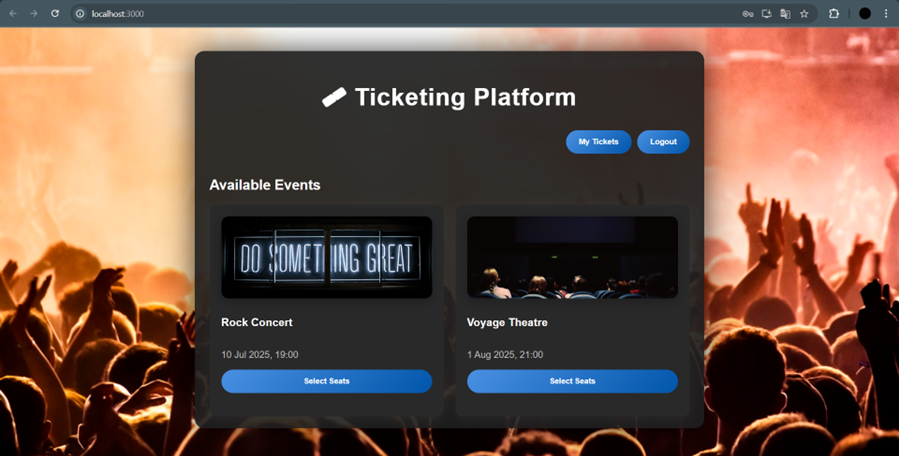
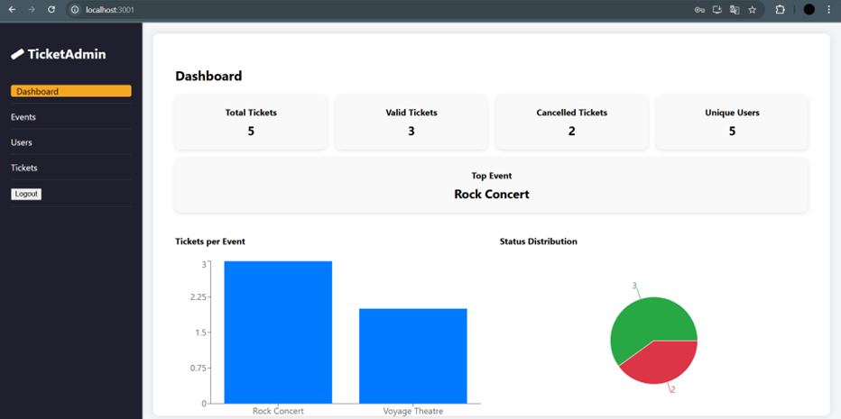
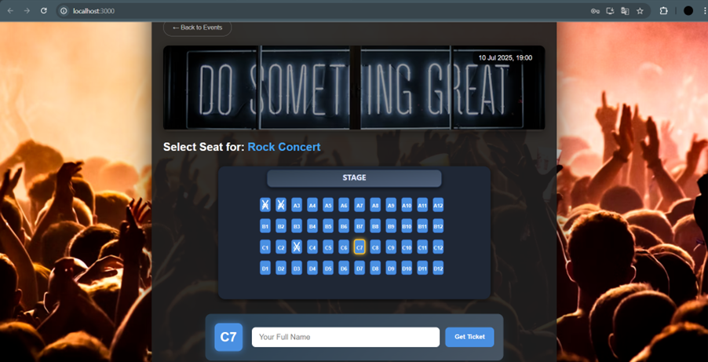
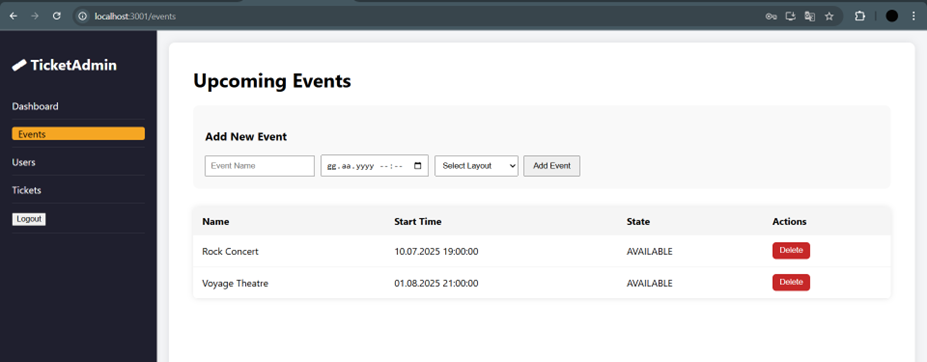

# 🎟️ Ticketing System – Full Stack Application

**User View – Select Events, Seats, and View Tickets**

**Admin Dashboard – Monitor, Manage Events and Tickets**

This project is a complete ticketing platform where users can view upcoming events, select seats, purchase tickets, and view/cancel them — while admins manage events, users, and ticket status through a dedicated dashboard.

## 🛠 Technologies

### Backend
- Java 17 & Spring Boot
- JWT Authentication & Spring Security
- PostgreSQL with JPA/Hibernate

### Frontend
- React (with Hooks)
- SVG-based Seat Map
- Fetch API Integration
- Separate panels for User & Admin

## 👥 User Roles

- **User**: Can view events, choose seats, create and cancel tickets
- **Admin**: Can add/delete events, view users, cancel any ticket, and access statistics

## 📸 Screenshots

| User Side | Admin Side |
|-----------|-------------|
|  |  |
|  |  |

## Developer Notes

This project was developed as part of my 2025 summer internship.  
The full-stack system was implemented entirely from scratch.

